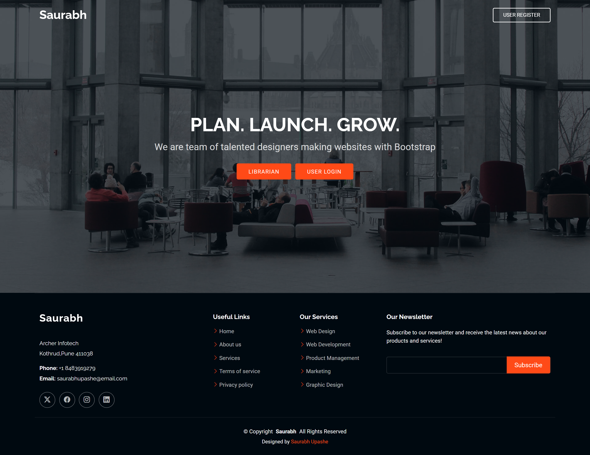
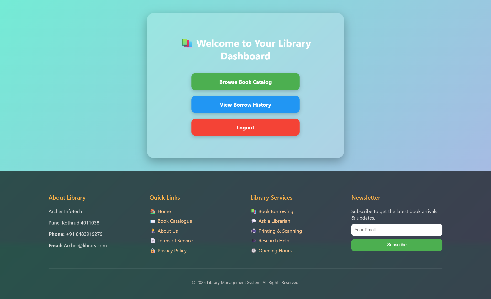

# 📚 Library Management System

A robust and dynamic web-based Library Management System built using **Java Servlets**, **JSP**, **JDBC**, and **MySQL**. This system allows users to view, borrow, and return books, while administrators can manage books, approve borrow requests, and track returns — all through a well-designed dashboard with role-based access.

---

## 📌 Table of Contents

- 📖 Project Description  
- 🛠️ Technologies Used  
- ✨ Features  
- 📁 Folder Structure  
- 📸 Screenshots  
- 🔧 How to Run  
- 📬 Contact  

---

## 📖 Project Description

This project aims to digitalize library operations like book inventory management, borrow/return workflows, and user authentication. The system consists of multiple roles:

- **Admin**: Add, update, delete books; approve borrow requests; manage returns.
- **User**: View available books; request to borrow and return them.

The system uses **JSP with EL**, **Servlets for business logic**, and **JDBC** to connect to a **MySQL database**. The interface is built with embedded **HTML/CSS/JS**, ensuring a smooth and interactive experience.

---

## 🛠️ Technologies Used

- Java Servlet & JSP  
- JDBC (Java Database Connectivity)  
- MySQL  
- HTML5, CSS3, JavaScript  
- Apache Tomcat  
- JSTL & Expression Language (EL)  
- Embedded CSS with animations  
- MVC Architecture

---

## ✨ Features

### 👨‍🏫 Admin Panel
- Add, update, delete books
- Approve or reject user borrow requests
- View borrow/return history
- Dashboard with full inventory control

### 👨‍🎓 User Panel
- Login and view book catalog
- Send borrow request
- Return books
- View approved and pending transactions

### 💎 UI/UX
- Modern and clean design using embedded CSS
- Animated forms, buttons, and tables
- Custom gradient backgrounds and responsive layout
- Footer only appears on scroll for clean first-view

---

## 📁 Folder Structure


---

## 📸 Screenshots

### 🔐 Index Page


### 🔐 Registration Page


### 🔐 Login Page


### 🛠️ Admin Dashboard


### 🛠️ Admin Dashboard


---

## 🔧 How to Run

### ✅ Prerequisites

- Java JDK 8 or above  
- Apache Tomcat 9 or above  
- MySQL Server  
- MySQL Connector/J `.jar` file  
- IDE (Eclipse / IntelliJ / NetBeans)

### 🚀 Steps

1. **Clone or Download Project**

   ```bash
   git clone https://github.com/yourusername/Library_Management_System.git
